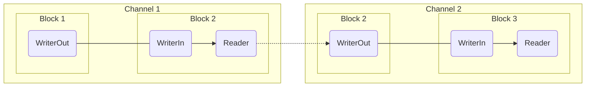

# Blocks

## Background
Rowbot was originally designed as a simple api built on top of TPL Dataflow, a set of .NET components for building data pipelines. The primary reason Dataflow was chosen was for the producer/consumer architecture which allows for batch processing of data. This removes the need to load an entire dataset into memory before transformation.

It was clear from the start that most of the power of TPL Dataflow was not utilised. 
- Parallelisation is typically unnecessary for an ETL data pipeline which is primarily IO-bound.
- Features like forking and rejoining pipelines are not supported in the simple Rowbot data pipeline format. 
- In Rowbot, data is passed between blocks as an array. While Dataflow supports this, it isn't the typical pattern used and it made dealing with generic arguments in PipelineBuilder more confusing.

Eventually Dataflow was replaced with .NET Channels, a simpler producer/consumer abstraction. Rowbot pairs Channels with a lightweight block architecture inspired by TPL Dataflow that supports dynamic linking of producers and consumers in series.

| :information_source: Technical Note |
| --- |
| <p>One thing that TPL Dataflow has that Channels doesn't is threading support. Although parallelisation is typically unnecessary for an ETL pipeline, it can be a nice pattern for isolation. An early build of Rowbot used ThreadLocal to guarantee isolation of dependent services by thread. In the end, this architecture proved overly complicated.</p><p>Rowbot built on .NET Channels moves everything to an asynchronous task programming model. Synchronisation between threads is now the responsibility of the developer building the dependent service.</p> |

## Design

A data pipeline is made up of a series of blocks that are linked together in series. The term **block** is borrowed from TPL Dataflow. 

### Interfaces
- All block types implement `IBlock` to create a task.
- A block implementing `IBlockSource<T>` is a producer and links to a consumer implementing `IBlockTarget<T>`.
- A block implementing `IBlockTarget<T>` is a consumer and accepts input from a `ChannelWriter<T>`.
 
Rowbot includes four block types, one each for extract, transform, and load, and an additional generic task block.

| Block Type | Interfaces Implemented | Channels Support |
|---|---|---|
| Extract | `IBlock`, `IBlockSource<T>` | Write |
| Transform | `IBlock`, `IBlockSource<T>`, `IBlockTarget<T>` | Read/Write |
| Load | `IBlock`, `IBlockTarget<T>` | Read |
| Task | `IBlock` | N/A |

### Channels
The extract and transform blocks produce data by writing to a channel with `ChannelWriter<T>`. The transform and load blocks consume data by reading form a channel with `ChannelReader<T>`. The `IBlockSource<T>` and `IBlockTarget<T>` interfaces include these properties.

```csharp
public interface IBlockSource<TOutput> : IBlock
{
    ChannelWriter<TOutput[]>? WriterOut { get; }
    void LinkTo(IBlockTarget<TOutput> target);
}
```

`IBlockSource<T>` is straightforward. The channel writer, `WriterOut`, is intended to write data to a consumer. It is nullable because it's not assigned on instantiation of the block - a call to LinkTo is required.


```csharp
public interface IBlockTarget<TInput> : IBlock
{
    ChannelReader<TInput[]> Reader { get; }
    ChannelWriter<TInput[]> WriterIn { get; }
}
```

`IBlockTarget<T>` includes a channel reader and writer.
- The channel writer `WriterIn` is a reference to the `WriterOut` of the producer block. These refer to the same object instance across producer and consumer blocks.
- The channel reader `Reader` is used to read data from the producer.

