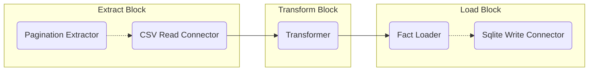
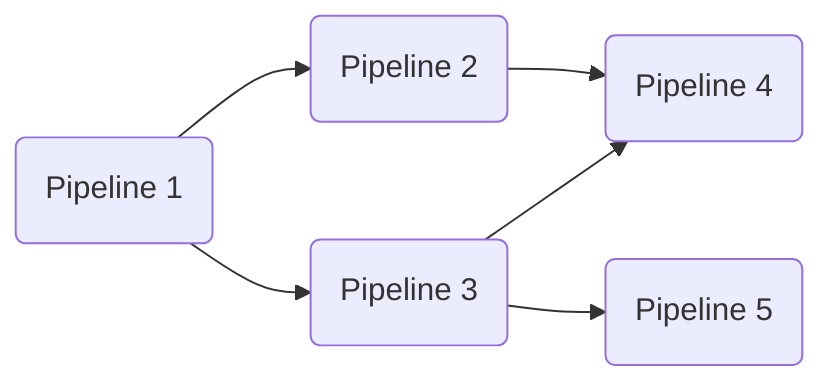

# Contributor - Get Started

## Core Abstractions

### Fields and Entities
A **field** represents a type of data. It commonly describes a column in a database table but could equally describe a field type in a JSON schema or a column in a CSV file. 
[Contributor -> Fields](Fields.md)

An **entity** is a grouping of fields. It provides generic methods for accessing and comparing values of a field. 
[Contributor -> Entities](Entities.md)

### Connectors
A connector is responsible for either reading from or writing to a data source. For example, a SQLite connector would include the logic to query, insert, and update, rows in a database table. 
[Contributor -> Connectors](Connectors.md)

### Extractors, Transformers, and Loaders
Extractors, transformers, and loaders allow a developer to customise the extract, transform, load (ETL) process. 

- An **extractor** customises how data is queried from a source system. An example that is built into Rowbot is pagination. Rather than retreiving all data in a single query, the pagination extractor allows data to be queried in pages. [Contributor -> Extractors](Extractors.md)

- A **transformer** modifies data between extract and load. The built-in transformer allows the developer to run any code within a specified lambda function. An interface exists to give the developer more control over things like threading or dependency injection. [Contributor -> Transformers](Transformers.md) 
  [Contributor -> Mapper](Mapper.md)

- A **loader** customises how data is written to a target system. Rowbot uses this abstraction to support loading data into a data warehouse. This enables, for example, a type 2 slowly changing dimension update which requires both an update and an insert operation at the target. [Contributor -> Loaders](Loaders.md)

## Pipeline Builder
Rowbot provides the `IPipelineBuilder` interface and several builder classes. The builder is designed to be extended using extension methods. All built-in extractors and loaders are built using this mechanism.

### Extensibility
Pipeline builder supports customisation by providing entry points for developers to write extension methods that retrieve configuration from the user. [Contributor -> Pipeline Builder](Pipeline%20Builder.md)

### Blocks
The pipeline builder outputs a `Pipeline` object that contains a series of blocks. A block is a container that runs an extractor, transformer, loader, or other pipeline task. The pipeline builder ensures that extract, transform, and load blocks are linked in the correct order. [Contributor -> Blocks](Blocks.md)

## Pipeline Runner
Rowbot includes a simple mechanism for data pipeline orchestration. The pipeline runner is responsible for executing data pipelines in the correct order. This enables composition within projects, where simple data pipelines provide the building blocks for more complicated ones. [Contributor -> Pipeline Runner](Pipeline%20Runner.md)

### Pipeline Registration
Pipelines are automatically registered via assembly scanning. Any class implementing the `IPipelineContainer` interface is scanned, and any method returning `Pipeline` is registered as a data pipeline. [Contributor -> Pipeline](Pipeline.md)

### Dependency Resolution
Pipeline builder provides the user with a `DependsOn()` method that defines which other data pipelines should run ahead of the current one.

The dependency resolver performs a topological sort on the data pipeline graph to determine the correct order for execution. It also validates there are no circular references in the graph.

