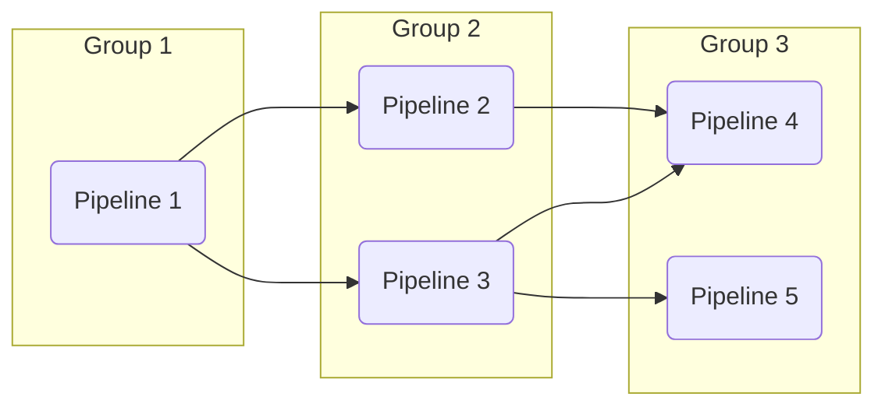
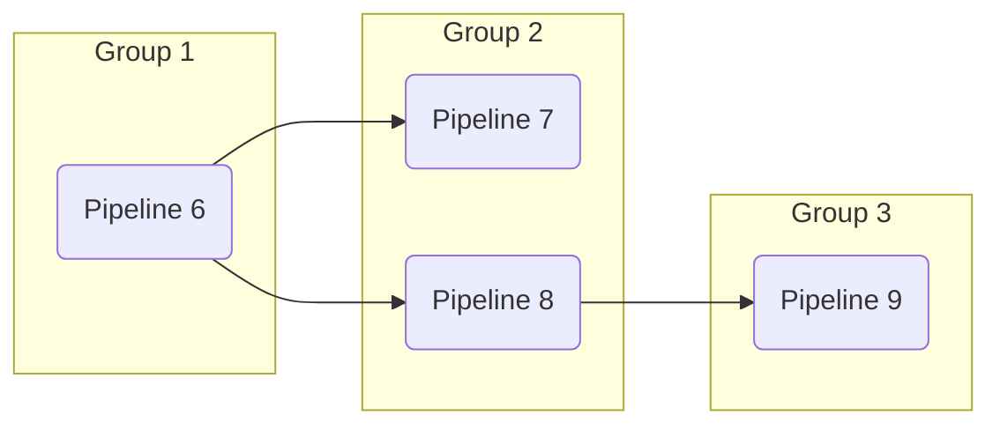

# Pipeline Runner

## Background
The pipeline runner was an early requirement of Rowbot because the coordination of many small data pipelines demands some amount of automation.

Rowbot was built as a replacement for a similarly functioning system that lacked basic data pipeline orchestration. The result was that every project required a configuration file that listed data pipelines in the order in which they were to run. This works, and there is arguably some value in being able to quickly see how the project is structured, but in practice, the exact order matters less than the guarantee that dependent data pipelines will always run after those on which they depend.

## Design

### Pipeline Registration
To avoid having to manually register data pipelines with dependency injection, Rowbot includes an extension method `services.AddRowbot()` that scans the executing assembly (or a given list of assemblies) and automatically registers pipeline containers (classes implementing `IPipelineContainer`).

```csharp
Host.CreateDefaultBuilder(args)
    .ConfigureServices((services) =>
    {
        services.AddRowbot();
    })
    .Build();
```

### Dependency Declaration
Pipeline runner is a declarative data pipeline orchestrator. A user declares the target data type of the pipeline implicitly and any source data types it depends on explicitly using the pipeline builder.

- The **Target** data type is collected during pipeline loader configuration.
- Any **Source** data type dependencies are added using the `DependsOn<T>` method of `IPipelineBuilder`.

### Dependency Resolution
`PipelineRunner` collects this metadata (source and target data types) from every data pipeline and orders execution based on dependency. It does this by iterating over every pipeline container (`IPipelineContainer`) registered for dependency injection, finding every method within the container with a return type of `Pipeline`, and invoking each.
 
`PipelineRunner` then performs a topological sort, taking a list of `Pipeline` nodes and producing a directed graph ordered by dependency. Pipeline runner's implementation of topological sort returns a `List<List<EntityGraphNode>>` where `EntityGraphNode` is a container for the `Pipeline` and its associated metadata. 

The nested lists (`List<List<EntityGraphNode>>`) represent clusters of groups of pipelines.

#### Grouping 
Each group (inner list of `List<List<EntityGraphNode>>`) contains pipelines that do not depend on one another. Each group is ordered by dependency which means that pipelines in group 2 would require pipelines in group 1 to complete before they can be started. 

#### Clustering
Each cluster (outer list of `List<List<EntityGraphNode>>`) contains a collection of groups of pipelines. A cluster is user-defined by decorating a pipeline container class with the `Cluster` attribute. The user is responsible for ensuring that clusters are completely independent because clusters are executed concurrently.

Clustering can result in faster loading of data from disparate sources. For example cluster 1 might load data from a local database while cluster 2 loads data from a remote HTTPS endpoint. Running these clusters concurrently may result in a significant reduction in total load time when compared to running the pipelines in series.

> Clustering can also be used for fault isolation. A pipeline exception in cluster 2 would not affect the operation of pipelines in cluster 1.

##### Cluster 1


##### Cluster 2


### Pipeline Execution
`PipelineRunner` invokes the `InvokeAsync()` method of a `Pipeline` to begin execution. All tasks are run asynchronously.
