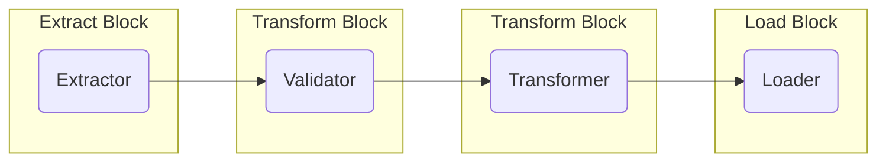

# Transformers

## Design
The transformer is the simplest mechanism in the data pipeline. It is essentially an entry point for custom logic that is executed after data extraction and before data load.

### Default Transformer
As the transformer is just an entry point for custom logic, the built-in, default, transformer is appropriate for most use cases.

Rowbot provides two implementations of the default transformer, one asynchronous and one synchronous. The synchronous implementation is marked `internal` and not intended to be used by anything other than the default transformer.

| Type | Transformer | Implements |
|---|---|---|
| **Asynchronous** | `Transformer<TSource, TTarget>` | `ITransformer<TSource, TTarget>` |
| **Synchronous** | `SynchronousTransformer<TSource, TTarget>` | `ISynchronousTransformer<TSource, TTarget>` |

Pipeline builder provides direct access to the default transformer. The `Transform()` method has two overloads, one with a synchronous delegate parameter `Func<TSource[], Mapper<TSource, TTarget>, TTarget[]>` and one with an asynchronous delegate parameter `Func<TSource[], Mapper<TSource, TTarget>, Task<TTarget[]>>`. These allow the developer to transform data of type `TSource` into data of type `TTarget` directly in pipeline builder or via another method with the same signature.

| :information_source: Technical Note |
| --- |
| <p>Ideally, the two overloads of `Transform()` would be extension methods. However, transformer chaining described below does not work well with extension methods because type inference breaks when calling pipeline builder's `AddTransformer<TService, TTarget, TOptions>` method - the extension method cannot infer `TSource` and it must be provided explicitly (which is a worse user experience).</p> |

### Chaining Transformers
Transformers are the only component in a Rowbot data pipeline that can be chained. Although it is recommended to keep data pipelines concise, the ability to convert to an intermediate data type between extract and load can be useful. 

Chaining transformers also provides the ability to decouple distinct steps like validation and transformation.



### Transparency
Transformers are designed primarily for transparency - important code shouldn't be hidden from the user. Transform logic should either be included directly in pipeline builder or in a separate method that is located nearby like in a local function directly beneath, or in an internal method in the same class if unit testing is required.

#### Recommended Approach
The transformation including the mapper configuration is clearly visible. 
> The recommended approach is only possible given simple transformations which is why small pipelines are also recommended.

```csharp
_pipelineBuilder
    .ExtractSqlite<SourceCustomer>()
    .Transform<TargetCustomer>(
        (source, mapper) =>
        {
            return source
                .Select(x => mapper.Apply(new TargetCustomer
                {
                    CustomerId = x.Id,
                    CustomerName = x.Name,
                    CustomerAddress = x.Address,
                    CustomerPhone = x.Phone
                }))
                .ToArray();
        },
        mapperConfiguration =>
        {
            mapperConfiguration.Transform.ToHashCode(hash => hash.Include(x => x.CustomerId), target => target.KeyHash);
            mapperConfiguration.Transform.ToHashCode(hash => hash.All(), target => target.ChangeHash);
        })
    .LoadSqlite();
```

#### Handler
An alternative to including all context directly within the pipeline definition is to use a handler architecture where transform logic is placed in a separate class. This approach isn't built into Rowbot but can be achieved by extending Rowbot with a custom transformer.

```csharp
_pipelineBuilder
    .ExtractSqlite<SourceCustomer>()
    .AddHandler<SourceCustomer, TargetCustomer>()
    .LoadSqlite();
```


## Extensibility - Create a Handler System
Custom transformers can be plugged into the pipeline builder. A handler system is simply a custom transformer.

About the handler system:
- A handler is a simple class that provides a `HandleAsync()` method which is executed at some stage in a pipeline. 
- In this example, handlers are transformers and so transform a source entity into a target entity. 
- Only one handler can be created for each combination of source and target.

### 1. Create handler interface
The handler interface is implemented by a handler class. It has one method `HandleAsync()` which takes an array of entities of type `TSource` and returns an array of entities of type `TTarget`.

```csharp
public interface IHandler<TSource, TTarget>
{
    Task<TTarget[]> HandleAsync(TSource[] source);
}
```

### 2. Create a handler
Implement `IHandler<TSource, TTarget` to create a handler.

```csharp
public sealed class CustomerHandler : IHandler<SourceCustomer, TargetCustomer>
{
    public Task<TargetCustomer[]> HandleAsync(SourceCustomer[] source) => Task.FromResult(Array.Empty<TargetCustomer>());
}
```

### 3. Create a transformer options class
The options class for the handler system requires no configurable state.

```csharp
public sealed class HandlerTransformerOptions<TSource, TTarget> { }
```

### 4. Create transformer and implement `ITransformer<TSource, TTarget, TOptions>`
`HandlerTransformer` receives the handler via constructor injection - handlers are registered with dependency injection automatically - see step 6.

The `Options` property must be implemented but is unused in this example. A handler is likely to contain its own configuration and won't need this to be passed in from the pipeline.

```csharp
public sealed class HandlerTransformer<TSource, TTarget> : ITransformer<TSource, TTarget, HandlerTransformerOptions<TSource, TTarget>>
{
    private readonly IHandler<TSource, TTarget> _handler;

    public HandlerTransformer(IHandler<TSource, TTarget> handler)
    {
        _handler = handler;
    }

    public HandlerTransformerOptions<TSource, TTarget> Options { get; set; } = new();

    public async Task<TTarget[]> TransformAsync(TSource[] source)
    {
        return await _handler.HandleAsync(source);
    }
}
```

### 5. Create extension method to plug-in to pipeline builder

```csharp
public static class HandlerExtensions
{
    public static IPipelineTransformer<TSource, TTarget> AddHandler<TSource, TTarget>(
        this IPipelineTransformer<TSource, TSource> pipelineTransformer)
    {
        return pipelineTransformer.AddTransformer<HandlerTransformer<TSource, TTarget>, TTarget, HandlerTransformerOptions<TSource, TTarget>>();
    }
}
```

#### Usage

```csharp
_pipelineBuilder
    .ExtractSqlite<SourceCustomer>()
    .AddHandler<SourceCustomer, TargetCustomer>()
    .LoadSqlite();
```

| :information_source: Technical Note |
| --- |
| <strong>Extension methods break transformer chaining</strong><br /><p>Using an extension method to add a transformer to the pipeline prevents the ability to chain transformers. The result is that only one transformer is supported per pipeline.</p><p>A workaround is to not use an extension method and add the transformer using the AddTransformer() method directly. The syntax is not nearly as clean but because extension methods are not involved, transformer chaining works.</p> |

```csharp
_pipelineBuilder
    .ExtractSqlite<SourceCustomer>()
    .AddTransformer<ValidatorTransformer<SourceCustomer, ValidCustomer>, ValidCustomer, ValidatorTransformerOptions<SourceCustomer, ValidCustomer>>()
    .AddTransformer<HandlerTransformer<ValidCustomer, TargetCustomer>, TargetCustomer, HandlerTransformerOptions<ValidCustomer, TargetCustomer>>()
    .LoadSqlite();
```

### 6. Automatically register handlers with dependency injection
Handlers are often automatically registered with dependency injection. Handlers can be found by scanning the executing assembly for any classes implementing `IHandler<,>`.

`HandlerTransformer<,>` is also registered with DI so that it can be instantiated by the `ServiceFactory`.

```csharp
internal static IServiceCollection RegisterHandlers(this IServiceCollection services)
{
    foreach (var implementationType in Assembly.GetExecutingAssembly()
        .ExportedTypes
        .Where(x => x.GetInterfaces().Any(x => x.IsGenericType && x.GetGenericTypeDefinition() == typeof(IHandler<,>))))
    {
        var serviceType = implementationType.GetInterfaces().First(x => x.IsGenericType && x.GetGenericTypeDefinition() == typeof(IHandler<,>));
        services.AddTransient(serviceType, implementationType);
    }

    return services;
}

services.AddTransient(typeof(HandlerTransformer<,>));
services.RegisterHandlers();
```

