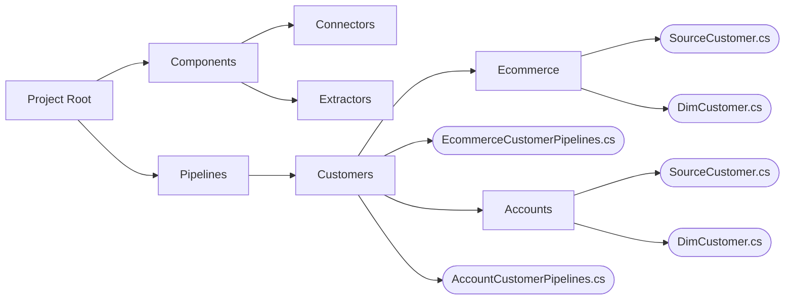

# Project Structure

## Pipelines Project
A project contains pipelines and custom components such as connectors, extractors, and loaders. Because Rowbot promotes the use of many small data pipelines, the project will likely contain many more pipelines than it does custom components. In certain cases, a custom extractor may be required to extract data from a specific source system; however, best practice is to make custom components reusable.

The most important aspect of project structure to consider is entity dependency resolution. Dependencies between pipelines are declared by data type which means that a type must exist in the same project as a pipeline that depends on it. 

> If a pipeline doesn't explicitly declare dependencies, then the runner will execute pipelines in a random order.

The simplest way to manage this is to include every pipeline in one project. Alternatively, separate pipeline projects could share an assembly containing entity classes.

## Suggested Structure
One suggested approach to project design is to keep everything in a single project and arrange pipelines by target entity type, then by source system.

### Description
In this example, customers are being loaded from two source systems, an eCommerce web application and the accounts management system. Data pipeline classes **EcommerceCustomerPipelines.cs** and **AccountCustomerPipelines.cs** are located directly under the **Customers** directory while entity classes for each are located in their respective subdirectories.

The two entities named **SourceCustomer.cs** are completely different and specific to the data format of their source system, but the two entities named **DimCustomer.cs** are the same or similar because they describe the same target dimension. 

In many cases it makes sense that the target entities are separate classes because: 
- Different source systems may not load exactly the same data. For example, an accounts customer may include a contact phone number while an eCommerce customer does not. 
- Data pipelines declare dependencies by data type. Therefore, a data pipeline that loads deleted rows from the accounts database may depend on the pipeline that inserts and updates rows to occur first, but does not depend on any pipelines related to eCommerce customers.